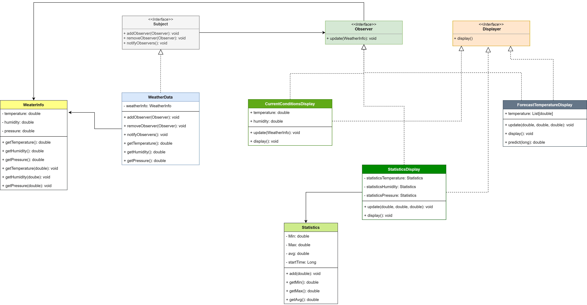

# Observer Design Pattern

## Example to Build
   - We want to build weather-o-rama that takes the weather information from hardware (Maybe sensors)
   - We don't care about how to get the new values (temperature, humidity and pressure)
   - And we have displayers **(they can be changed)**
   - We want to notify them if the values updated

## Design

### OO principles
   - **First principle**: encapsulate what varies
     - encapsulate the displayers
       - By making a set of classes that implements the Displayer `interface`

   - **Second principle**: program to an interface, not an implementation
     - We will make an `interface` for displayers to implement
     - to deal with any Observers when there is any change in values we can call `update` method for any class that implements the WeatherObserver `interface`

   - **Third principle**: Favor composition over inheritance
     - We can store the Observers in the WeatherData class as a list/set
     - We can update the list by adding or removing any observer

    - Now when we update  values (temperature, humidity, and pressure) we can call a method `notifyObservers`
      - the `notifyObservers` is in the `WeatherData` class
      - We store the observers in `weatherObservers`
      - those observers in their classes implement `WeatherObserver` interface that have `update` method (to notify them when any change happend)
      - the basic code for the method `notifyObservers`
```java
    @Override
    public void notifyObservers() {
        for (WeatherObserver weatherObserver : weatherObservers) {
            weatherObserver.update(weatherBasicInfo);
        }
    }
```

## Class Diagram


### Design patterns
   - **Observer design pattern**: defines a one-to-many dependency between objects so that when one object changes state, all of its dependents are notified and updated automatically
   - That is what we have done
     - one object: is the `WeatherData` that notify the Observers
     - many objects: are the weatherObservers (displayers)
     - the WeatherData notifies them if there is any change

### Loose coupling
  - It means that the class have minimum knowledge about the other classes
  - That is helpful to give you flexibility (when changing one class, You shouldn't change other classes)
  - All classes have dependency on other classes but we want to make it minimum
  - In our example
    - The `WeatherData` doesn't know how the observers will make if there is any change, the `WeatherData` is just notifying them

### new principle
  - Strive for loosely coupled designs between objects that interact.

    


